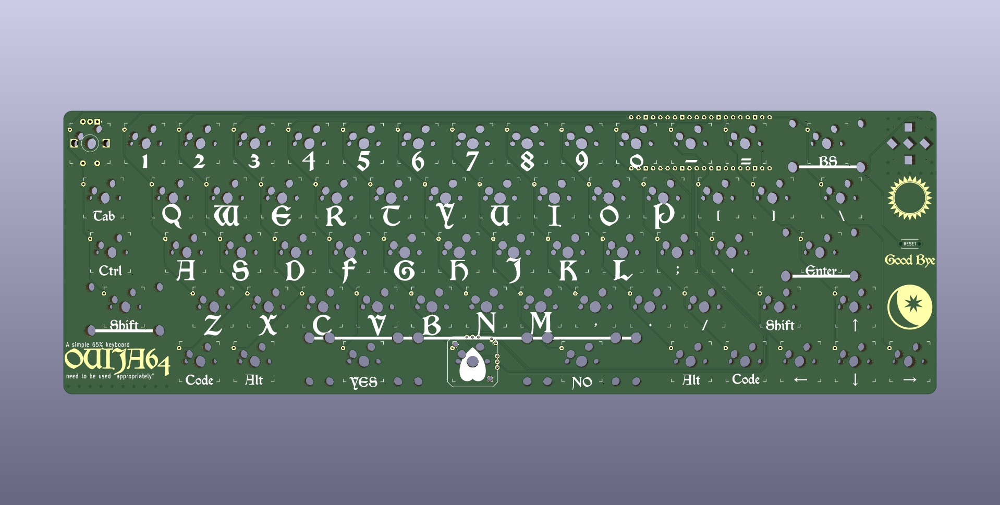

# ouija64 ビルドガイド #

## 目次 ##
- [ouija64 ビルドガイド](#ouija64-ビルドガイド)
  - [目次](#目次)
  - [はじめに](#はじめに)
  - [ouija64の対応機能について](#ouija64の対応機能について)
  - [ページマップ](#ページマップ)
  - [連絡先](#連絡先)

## はじめに ##
このページはouija64の組み立て手順を解説するページです。  
事前に全体を読んだ上で作業を開始してください。  
また、遊舎工房で販売中の[工具セット](https://shop.yushakobo.jp/collections/accessory/products/a9900to)と同程度の工具を所有していることを前提として解説を進めます。  

## ouija64の対応機能について ##
ouija64は[GL516](https://salicylic-acid3.hatenablog.com/entry/gl516-introduction)に対応した65%自作キーボードです。  

- GL516互換キーボード  
- 65% ANSIレイアウト  
- Raspberry Pi Pico  
- Cherry MX互換キースイッチ  
- Cherry MX互換キーキャップ  
- PCB用スイッチソケット  
- SMDダイオード（1N4148W）  
- ロータリーエンコーダー  
- ジョイスティック  
- インジゲーター用LED(sk6812mini-e)  

## ページマップ ##
組み立てるにあたって使用するファイルが本リポジトリには格納されています。  

- firmware_source  
    ファームウェアを書き出すためのファイルが格納されています。  
    現時点でQMK_sekigon内にのみファイルがありますが、これはQMK側の対応待ちなためです。  
    QMKの正式対応はおそらく2022年5月末であり、その後公式のリポジトリにファームウェアをPRする予定です。  
    KMKやPRKにつきましては、作者が触れてきていないため学習から入りますので対応時期は不明ですが対応予定です。
- uf2  
    Raspberry Pi Picoに導入できるようにコンパイルされたデータです。  
- picture  
    本ガイドのために撮影した画像です。  
- plate  
    スイッチ用プレート及びアクセントプレートのaiファイルが同梱されています。  

## 連絡先 ##
Twitter:[marbySAN](https://twitter.com/marbySAN)  
Discord:marby#2153  
