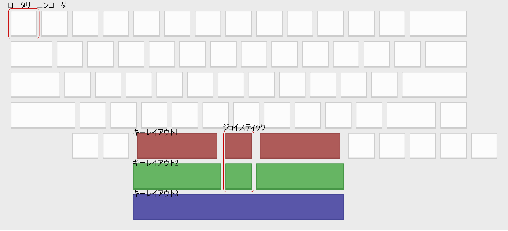

# ouija64ビルドガイド #

### 目次 ###
- [ouija64ビルドガイド](#ouija64ビルドガイド)
    - [目次](#目次)
    - [はじめに](#はじめに)
  - [全体の流れ](#全体の流れ)
    - [ファームウェアについて注意](#ファームウェアについて注意)
  - [01. 内容品及び追加購入品が数通りあることを確認する](#01-内容品及び追加購入品が数通りあることを確認する)
    - [内容品](#内容品)
    - [追加購入品](#追加購入品)
  - [02. レイアウトを決定する](#02-レイアウトを決定する)
    - [キーレイアウト](#キーレイアウト)
    - [ロータリーエンコーダ](#ロータリーエンコーダ)
    - [ジョイスティック](#ジョイスティック)
  - [03. PCBに部品を実装する](#03-pcbに部品を実装する)
    - [03.01. PCBにSMDダイオードをはんだ付けする](#0301-pcbにsmdダイオードをはんだ付けする)
    - [03.02. PCBにPCB用スイッチソケットをはんだ付けする](#0302-pcbにpcb用スイッチソケットをはんだ付けする)
    - [03.03.](#0303)
  - [04. Raspberry Pi Picoにファームウェアを書き込み、PCBの動作チェックを行う](#04-raspberry-pi-picoにファームウェアを書き込みpcbの動作チェックを行う)
    - [04.01. Raspberry Pi Picoにファームウェアを書き込む](#0401-raspberry-pi-picoにファームウェアを書き込む)
    - [04.02. PCBの動作チェックをする](#0402-pcbの動作チェックをする)
  - [05. プレート類を順番に組み立てる](#05-プレート類を順番に組み立てる)
    - [05.01. スタビライザーを固定する](#0501-スタビライザーを固定する)
  - [06. スイッチを差し込みキーキャップを付ける](#06-スイッチを差し込みキーキャップを付ける)
    - [06.01 スイッチをスイッチプレートに嵌め込む](#0601-スイッチをスイッチプレートに嵌め込む)
    - [06.02. スイッチにキーキャップを付ける](#0602-スイッチにキーキャップを付ける)
  - [07. 完成！](#07-完成)

### はじめに ###
このページはouija64の組み立て手順を解説するページです。  
事前に全体を読んだ上で作業を開始してください。  
また、遊舎工房で販売中の[工具セット](https://shop.yushakobo.jp/collections/accessory/products/a9900to)と同程度の工具を所有していることを前提として解説を進めます。  

## 全体の流れ ##
初心者の方であれば、4～5時間ほどの作業時間を確保した上で作業することをおすすめします。  
01. [内容品及び追加購入品が数通りあることを確認する](#01-内容品及び追加購入品が数通りあることを確認する)  
02. [レイアウトを決定する](#02-レイアウトを決定する)  
03. [PCBに部品を実装する](#03-pcbに部品を実装する)  
04. [Raspberry Pi Picoにファームウェアを書き込み、PCBの動作チェックを行う](#04-raspberry-pi-picoにファームウェアを書き込みpcbの動作チェックを行う)
05. [プレート類を順番に組み立てる](#05-プレート類を順番に組み立てる)  
06. [スイッチを差し込みキーキャップを付ける](#06-スイッチを差し込みキーキャップを付ける)  
07. [完成！](#07-完成)  

### ファームウェアについて注意
ファームウェアについて、QMK Firmwareに本キーボードのファームウェアを今後追加予定です。  
- QMK Firmware  
    公式へ追加予定  
- VIA  
    QMK Firmwareがマージされた後に追加予定  
- Remap  
    QMK Firmwareがマージされた後に追加予定  
- PRK Firmware / KMK Firmware 
    上記の作業が終わった後に追加検討をする予定  

## 01. 内容品及び追加購入品が数通りあることを確認する ##
### 内容品 ###
[Ouija64](https://shop.yushakobo.jp/products/XXX)に同梱されています。  
| NO | 部品名 | 数量 | 備考 |
| :---: | :---: | :---: | :---: |
| 1 | PCB | x1 | PCB v1.0α |
| 2 | SMDダイオード | x64 |  |
  

また、[アドオン用の購入ページ]()も用意しています。
| NO | 部品名 | 数量 | 備考 |
| :---: | :---: | :---: | :---: |
| 1 | JoyStick | x1 |   |
| 2 | JoyStick用3Dプリントカバー | x1 |  |

※不足品があった場合はご連絡をお願いします。  

### 追加購入品 ###
追加で購入する必要がある部品です。  
レイアウトにより購入する必要のある数が変動します。  
| NO | 部品名 | 数量 | 備考 |
| :---: | :---: | :---: | :---: |
| 1 | Raspberry Pi Pico | x1 | [購入ページ](https://shop.yushakobo.jp/products/raspberry-pi-pico) |
| 2 | 20ピン ピンヘッダー | x2 | [購入ページ](https://shop.yushakobo.jp/products/3696?variant=42476836946151) |
| 3 | 20ピン ピンソケット | x2 | [購入ページ](https://shop.yushakobo.jp/products/3696?variant=42476836978919) |
| 4 | SK6812MINI-E | x4 | 光らせない場合実装不要 [購入ページ（10個入なので1つで足ります）](https://shop.yushakobo.jp/products/sk6812mini-e-10) |
| 5 | スイッチ用PCBソケット | x64 | [購入ページ](https://shop.yushakobo.jp/products/a01ps) |
| 6 | Cherry MXスイッチ | x適量 | レイアウトによる [購入ページ](https://shop.yushakobo.jp/collections/all-switches/cherry-mx-%E4%BA%92%E6%8F%9B-%E3%82%B9%E3%82%A4%E3%83%83%E3%83%81) |
| 7 | CherryMXキーキャップ | x適量 | レイアウトによる [購入ページ](https://shop.yushakobo.jp/collections/keycaps/cherry-mx-%E4%BA%92%E6%8F%9B-%E3%82%AD%E3%83%BC%E3%82%AD%E3%83%A3%E3%83%83%E3%83%97) |
| 8 | ロータリーエンコーダー | x1 | レイアウトによる [購入ページ](https://shop.yushakobo.jp/products/3762) |
| 9 | スタビライザー | x適量 | レイアウトによる [スナップイン](https://shop.yushakobo.jp/products/a0500st) [プレートマウント](https://shop.yushakobo.jp/products/gateron-pre-lubed-plate-mounted-stabilizers-104-keyboard-set)  |
| 10 | USBケーブル | x1 | USB A to Micro-B [購入ページ](https://shop.yushakobo.jp/products/usb-cable-micro-b-0-8m) |
| 11 | パネルマウントケーブル | x1 | [購入ページ](https://shop.yushakobo.jp/products/3764) |
| 12 | GL516 ケース | x1 | [購入ページ](https://shop.yushakobo.jp/products/XXXX) |
| 13 | スイッチプレート | x1 | バリエーションあり [購入ページ](https://shop.yushakobo.jp/products/keyboard_acrylic_plate) |
  

## 02. レイアウトを決定する
ouija64はキーレイアウトが3種類、左上のキーがロータリーエンコーダと変更可能です。ジョイスティックの利用もできます。  
  
[Keyboard Layout Editor](http://www.keyboard-layout-editor.com/#/gists/fc1506d34f3c388d9b25e23d14820262)  

### キーレイアウト ###
  - キーレイアウト1  
    2～2.75U + 1U + 2～2.75Uのレイアウトです。  
    中央のキーに関しては、2Uキーキャップ等を使用することで1.75Uまで変更可能です。  
  - キーレイアウト2  
    3U + 1U + 3Uのレイアウトです。  
    3Uのキーキャップが珍しいため少々難しいレイアウトになりますが、綺麗なレイアウトです。  
  - キーレイアウト3  
    7Uのレイアウトです。  
    一般的なレイアウトに仕上がるため、選択肢に迷ったらこれを選ぶと良いでしょう。  

### ロータリーエンコーダ ###
左上のキーはロータリーエンコーダと交換可能です。  
ロータリーエンコーダはEC12互換品が使用できます。  

### ジョイスティック ###
キーレイアウト1 / キーレイアウト2については、中央のキーはジョイスティックに変更可能です。  

## 03. PCBに部品を実装する ##
この作業でははんだ付けを行います。はんだごての推奨温度は320℃です。  
はんだごては高温になるため、この作業を開始する前にこの項目の文章をすべて読んでから開始してください。  
作業開始前、開始後にははんだごてのコンセントを必ず抜いてください。  

### 03.01. PCBにSMDダイオードをはんだ付けする ###
SMDダイオードをPCBにはんだ付けします。  
SMDダイオードには向きがあります。下記を参考にPCBの印字とダイオードの向きを合わせてはんだ付けをしてください。  

はんだ付けは[@Salicylic_acid3さんの動画](https://twitter.com/Salicylic_acid3/status/1108798243142434816)参考にしてください。動画の手順を下記で説明します。
1. 最初にダイオードの銅箔のうち、1箇所に予備のはんだ（予備はんだ）をつける
2. SMDダイオードをピンセットで掴み、予備はんだのそばに持ってくる
3. はんだごてで予備はんだを溶かし、SMDダイオードのピンを付ける
4. はんだごてを離す
5. もう片方のピンもはんだ付けする

### 03.02. PCBにPCB用スイッチソケットをはんだ付けする ###

### 03.03. 

## 04. Raspberry Pi Picoにファームウェアを書き込み、PCBの動作チェックを行う ##
### 04.01. Raspberry Pi Picoにファームウェアを書き込む ###
Raspberry Pi PicoをUSBケーブルでPCに接続し、uf2ファイルをコピー&ペーストします。  

### 04.02. PCBの動作チェックをする ###
Raspberry Pi PicoをPCBに装着し、USBケーブルでPCと接続します。
その後、

## 05. プレート類を順番に組み立てる ##

### 05.01. スタビライザーを固定する ###

## 06. スイッチを差し込みキーキャップを付ける
### 06.01 スイッチをスイッチプレートに嵌め込む ###
スイッチプレートにスイッチを嵌め込みます。  

### 06.02. スイッチにキーキャップを付ける ###
キーレイアウトを参考にしながら、キーキャップを付けます。

## 07. 完成！ ##

お疲れ様でした！！！  
