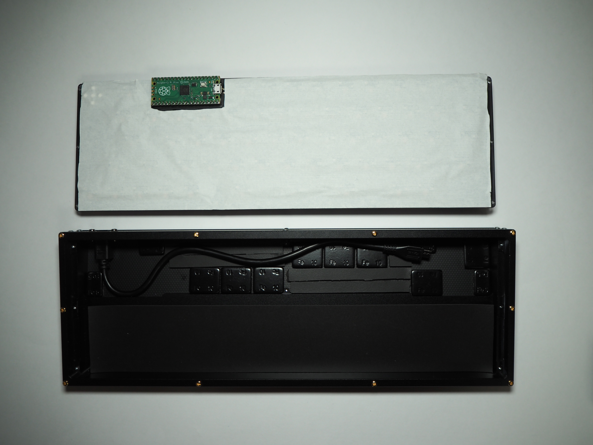

# ouija64ビルドガイド #

### 目次 ###
- [ouija64ビルドガイド](#ouija64ビルドガイド)
    - [目次](#目次)
    - [はじめに](#はじめに)
  - [全体の流れ](#全体の流れ)
    - [ファームウェアについて注意](#ファームウェアについて注意)
  - [01. 内容品及び追加購入品が数通りあることを確認する](#01-内容品及び追加購入品が数通りあることを確認する)
    - [内容品](#内容品)
    - [追加購入品](#追加購入品)
  - [02. レイアウトを決定する](#02-レイアウトを決定する)
    - [キーレイアウト](#キーレイアウト)
    - [ロータリーエンコーダ](#ロータリーエンコーダ)
    - [ジョイスティック](#ジョイスティック)
  - [03. PCBに部品を実装する](#03-pcbに部品を実装する)
    - [03.01. PCBにSMDダイオードをはんだ付けする](#0301-pcbにsmdダイオードをはんだ付けする)
    - [03.02. PCBにPCB用スイッチソケットをはんだ付けする](#0302-pcbにpcb用スイッチソケットをはんだ付けする)
    - [03.03. ピンヘッダーとピンソケットをはんだ付けする](#0303-ピンヘッダーとピンソケットをはんだ付けする)
    - [03.04. （オプション）ロータリーエンコーダをはんだ付けする](#0304-オプションロータリーエンコーダをはんだ付けする)
    - [03.05. （オプション）ジョイスティックをはんだ付けする](#0305-オプションジョイスティックをはんだ付けする)
    - [03.06. （オプション）LEDをはんだ付けする](#0306-オプションledをはんだ付けする)
  - [04. Raspberry Pi Picoにファームウェアを書き込み、PCBの動作チェックを行う](#04-raspberry-pi-picoにファームウェアを書き込みpcbの動作チェックを行う)
    - [04.01. PRK Firmwareをダウンロードする](#0401-prk-firmwareをダウンロードする)
    - [04.02. Raspberry Pi Picoにファームウェアを書き込む](#0402-raspberry-pi-picoにファームウェアを書き込む)
    - [04.03. Keymap.rbをRaspberry Pi Picoに書き込む](#0403-keymaprbをraspberry-pi-picoに書き込む)
    - [04.04. PCBの動作チェックをする](#0404-pcbの動作チェックをする)
  - [05. ouija64を順番に組み立てる](#05-ouija64を順番に組み立てる)
    - [05.01 GL516のバックプレートを固定する](#0501-gl516のバックプレートを固定する)
    - [05.02 パネルマウントケーブルをネジ止めする](#0502-パネルマウントケーブルをネジ止めする)
    - [05.03. スタビライザーを固定する](#0503-スタビライザーを固定する)
    - [05.04. スイッチを差し込む](#0504-スイッチを差し込む)
    - [05.05. スイッチプレートとPCBをスイッチで固定する](#0505-スイッチプレートとpcbをスイッチで固定する)
    - [05.06. スイッチプレートをネジ止めする](#0506-スイッチプレートをネジ止めする)
    - [05.07. ボトムプレートをネジ止めする](#0507-ボトムプレートをネジ止めする)
    - [05.08. スイッチにキーキャップを付ける](#0508-スイッチにキーキャップを付ける)
    - [05.09. （オプション）アクセントプレートをネジ止めする](#0509-オプションアクセントプレートをネジ止めする)
  - [06. 完成！](#06-完成)

### はじめに ###
このページはouija64の組み立て手順を解説するページです。  
事前に全体を読んだ上で作業を開始してください。  
また、遊舎工房で販売中の[工具セット](https://shop.yushakobo.jp/collections/accessory/products/a9900to)と同程度の工具を所有していることを前提として解説を進めます。  

## 全体の流れ ##
初心者の方であれば、4～5時間ほどの作業時間を確保した上で作業することをおすすめします。  
01. [内容品及び追加購入品が数通りあることを確認する](#01-内容品及び追加購入品が数通りあることを確認する)  
02. [レイアウトを決定する](#02-レイアウトを決定する)  
03. [PCBに部品を実装する](#03-pcbに部品を実装する)  
04. [Raspberry Pi Picoにファームウェアを書き込み、PCBの動作チェックを行う](#04-raspberry-pi-picoにファームウェアを書き込みpcbの動作チェックを行う)
05. [プレート類を順番に組み立てる](#05-プレート類を順番に組み立てる)  
06. [スイッチを差し込みキーキャップを付ける](#06-スイッチを差し込みキーキャップを付ける)  
07. [完成！](#07-完成)  

### ファームウェアについて注意 ###
ファームウェアについて、PRK Firmwareでの動作を確認しています。  
他のファームウェアの予定については下記を確認してください。  
- PRK Firmware
    公式へのPRは不要、対応済み
- QMK Firmware  
    RP2040の公式対応および、ADCドライバの読み取りが実施され次第対応を検討予定  
- VIA  
    対応予定なし
- Remap  
    Keymapと同時に公開   
- KMK Firmware  
    上記の作業が終わった後に追加検討をする予定  

## 01. 内容品及び追加購入品が数通りあることを確認する ##
### 内容品 ###
[Ouija64](https://shop.yushakobo.jp/products/XXX)に同梱されています。  
| NO | 部品名 | 数量 | 備考 | 画像 |
| :---: | :---: | :---: | :---: | :---: |
| 1 | PCB（基板） | x1 | PCB v1.0α |  |
| 2 | SMDダイオード | x64 |  |  |
| 3 | リセットスイッチ | x1 |  |  |

また、[アドオン用のジョイスティック購入ページ]()も準備中です。
| NO | 部品名 | 数量 | 備考 | 画像 |
| :---: | :---: | :---: | :---: | :---: |
| 1 | ジョイスティック | x1 |  |  |
| 2 | ジョイスティック用3Dプリントカバー | x1 | 3Dプリント製 |  |

※不足品があった場合はご連絡をお願いします。  

### 追加購入品 ###
追加で購入する必要がある部品です。  
レイアウトにより購入する必要のある数が変動します。  
| NO | 部品名 | 数量 | 備考 | 画像 |
| :---: | :---: | :---: | :---: | :---: |
| 1 | Raspberry Pi Pico | x1 | [購入ページ](https://shop.yushakobo.jp/products/raspberry-pi-pico) |  |
| 2 | 20ピン ピンヘッダー | x2 | [購入ページ](https://shop.yushakobo.jp/products/3696?variant=42476836946151) |  |
| 3 | 20ピン ピンソケット | x2 | [購入ページ](https://shop.yushakobo.jp/products/3696?variant=42476836978919) |  |
| 4 | SK6812MINI-E | x5 | 光らせない場合実装不要 [購入ページ（10個入なので1つで足ります）](https://shop.yushakobo.jp/products/sk6812mini-e-10) |  |
| 5 | スイッチ用PCBソケット（Cherry MX互換） | x64 | [購入ページ](https://shop.yushakobo.jp/products/a01ps) |  |
| 6 | Cherry MXスイッチ | x適量 | レイアウトによる [購入ページ](https://shop.yushakobo.jp/collections/all-switches/cherry-mx-%E4%BA%92%E6%8F%9B-%E3%82%B9%E3%82%A4%E3%83%83%E3%83%81) |  |
| 7 | CherryMXキーキャップ | x適量 | レイアウトによる [購入ページ](https://shop.yushakobo.jp/collections/keycaps/cherry-mx-%E4%BA%92%E6%8F%9B-%E3%82%AD%E3%83%BC%E3%82%AD%E3%83%A3%E3%83%83%E3%83%97) |  |
| 8 | ロータリーエンコーダー | x1 | レイアウトによる [購入ページ](https://shop.yushakobo.jp/products/3762) |  |
| 9 | スタビライザー | x適量 | レイアウトによる [スナップイン](https://shop.yushakobo.jp/products/a0500st) [プレートマウント](https://shop.yushakobo.jp/products/gateron-pre-lubed-plate-mounted-stabilizers-104-keyboard-set)  |  |
| 10 | USBケーブル | x1 | USB A to Micro-B [購入ページ](https://shop.yushakobo.jp/products/usb-cable-micro-b-0-8m) |  |
| 11 | パネルマウントケーブル | x1 | USB Micro-B [購入ページ](https://shop.yushakobo.jp/products/3764) |  |
| 12 | GL516 ケース | x1 | [購入ページ](https://shop.yushakobo.jp/products/XXXX) |  |
| 13 | スイッチプレート | x1 | [バリエーション](#02-レイアウトを決定する)あり [購入ページ](https://shop.yushakobo.jp/products/keyboard_acrylic_plate) |  |
| 14 | スイッチプレート | x1 | [バリエーション](#02-レイアウトを決定する)あり [購入ページ](https://shop.yushakobo.jp/products/keyboard_acrylic_plate) |  |
| 15 | M2 ネジ | x6（16） | スイッチプレート/アクセントプレート固定用（アクセントプレート固定時16個必要） おすすめは黒小ねじかバインド小ねじ [購入ページ](https://shop.yushakobo.jp/collections/all-keyboard-parts/Screw) |  |

## 02. レイアウトを決定する
ouija64はスイッチプレートのバリエーションが3種類あります。  
キーレイアウトが3種類、左上のキーがロータリーエンコーダと変更可能です。  
ジョイスティックの利用もできます。  
  
[Keyboard Layout Editor](http://www.keyboard-layout-editor.com/#/gists/fc1506d34f3c388d9b25e23d14820262)  

### キーレイアウト ###
  - **キーレイアウト1**  
    2～2.75U + 1U + 2～2.75Uのレイアウトです。  
    中央のキーに関しては、2Uキーキャップ等を使用することで1.5Uまで変更可能です。  
  - **キーレイアウト2**  
    3U + 1U + 3Uのレイアウトです。  
    3Uのキーキャップが珍しいため少々難しいレイアウトになりますが、綺麗なレイアウトです。  
  - **キーレイアウト3**  
    7Uのレイアウトです。  
    比較的普通なレイアウトに仕上がるため、選択肢に迷ったらこれを選ぶと良いでしょう。  

### ロータリーエンコーダ ###
左上のキーはロータリーエンコーダと変更可能です。  
ロータリーエンコーダはEC12互換品が使用できます。  
※ロータリーエンコーダをはんだ付けすると、スイッチへ交換できなくなります。  

### ジョイスティック ###
現時点ではスイッチのみ使用できません。  
キーレイアウト1 / キーレイアウト2については、中央のキーをジョイスティックに変更可能です。  
ジョイスティックは、PRK Firmwareの今後の対応により使用可能になります。  
※ジョイスティックをはんだ付けすると、スイッチへ交換できなくなります。  
## 03. PCBに部品を実装する ##
この作業でははんだ付けを行います。はんだごての推奨温度は320℃です。  
はんだごては高温で危険なため、この作業を開始する前にこの項目の文章をすべて読んでから開始してください。  
作業開始前、開始後にははんだごてのコンセントを必ず抜いてください。  

### 03.01. PCBにSMDダイオードをはんだ付けする ###
SMDダイオードをPCBにはんだ付けします。  
SMDダイオードには向きがあります。下記を参考にPCBの印字とダイオードの向きを合わせてはんだ付けをしてください。  
  

はんだ付けは[@Salicylic_acid3さんの動画](https://twitter.com/Salicylic_acid3/status/1108798243142434816)参考にしてください。  
動画の手順を下記で説明します。  
1. 最初にダイオードの銅箔のうち、1箇所に予備のはんだ（予備はんだ）をつける  
2. SMDダイオードをピンセットで掴み、予備はんだのそばに持ってくる  
3. はんだごてで予備はんだを溶かし、SMDダイオードのピンを付ける  
4. はんだごてを離す  
5. もう片方のピンもはんだ付けする  

### 03.02. PCBにPCB用スイッチソケットをはんだ付けする ###
PCB用スイッチソケットをPCBにはんだ付けします。  
PCB裏面に白い塗装（シルクと呼ばれます）がされているので、それに合わせてPCB用スイッチソケットをはめ込んでいきます。  
  
その後、PCB用スイッチソケットのパッド部分をはんだ付けしてください。  
  
### 03.03. ピンヘッダーとピンソケットをはんだ付けする ###
ピンヘッダーとピンソケットをはんだ付けします。  
ピンヘッダーはRaspberry Pi Picoにはんだ付けする必要があります。  
向きがあるので、下記のようにはんだ付けしてください。  
  
  
また、ピンソケットはPCBにはんだ付けする必要があります。  
PCBの裏面から差し込み、表面ではんだ付けをします。  
  
Raspberry Pi Picoの向きは決まっているので、画像を参考に差し込んでください。  
  
ピンヘッダー・ピンソケットを綺麗にはんだ付けするために、1箇所をはんだ付けした後、再度はんだを溶かして向きを修正する方法があります。  

### 03.04. （オプション）ロータリーエンコーダをはんだ付けする ###
ロータリーエンコーダをPCBにはんだ付けします。  
  

### 03.05. （オプション）ジョイスティックをはんだ付けする ###
ジョイスティックをPCBにはんだ付けします。  
  

### 03.06. （オプション）LEDをはんだ付けする ###
LED（SK6812mini-e）をPCBにはんだ付けします。  
表面から見て右上にある切り欠けにはLEDをはんだ付けすることで、インジケーターのように使用することが可能になります。  

## 04. Raspberry Pi Picoにファームウェアを書き込み、PCBの動作チェックを行う ##
### 04.01. PRK Firmwareをダウンロードする ###
PRK Firmwareをダウンロードします。  

PRK Firmwareの[チュートリアルドキュメント](https://github.com/picoruby/prk_firmware/wiki/Tutorial)内にある[Releases](https://github.com/picoruby/prk_firmware/releases)のリンクを開きます。  
基本的に一番上にある物が最新版です。  
その中のAssetsを開き、ファイルの拡張子が.zipもしくは.gzの物をクリックするとダウンロードが開始します。  

ダウンロードが完了したら、ファイルを解凍します。  
解凍後、フォルダ内に「prk_firmware-XXXX-XXXX.uf2」のようなファイルが入っているはずです。  
このファイルを次の工程で使用します。  

### 04.02. Raspberry Pi Picoにファームウェアを書き込む ###
04.01.にてダウンロードしたファイルをRaspberry Pi Picoに書き込みます。
そのためには、Raspberry Pi Picoを[BOOTSELモード](https://github.com/picoruby/prk_firmware/wiki/BOOTSEL-mode-of-RP2040)にする必要があります。  

一番簡単なのは、Raspberry Pi Picoの表面にあるタクタイルスイッチ（白いボタン）を押しながらUSBケーブルを接続する方法です。  
上手く行くとRaspberry Pi PicoがUSBメモリのような見た目でPCから見ることができるようになります。  
その後、先程04.01.にてダウンロードしたファイルをこのRaspberry Pi Picoにドラッグアンドドロップします。  
画像のように見えていれば書き込み成功です。  
  
※（E:）は環境によって異なる文字になることがあります。  

### 04.03. Keymap.rbをRaspberry Pi Picoに書き込む ###
04.02.にてPRK Firmwareを書き込んだRaspberry Pi Picoにkeymap.rb（キーボードの設定ファイル）を書き込みます。  

[こちらのリンク]()先からkeymap.rbファイルをダウンロードします。  
その後、ダウンロードしたファイルをPRK Firmwareを書き込んだRaspberry Pi Picoにドラッグアンドドロップします。  

### 04.04. PCBの動作チェックをする ###
Raspberry Pi PicoをPCBに装着し、USBケーブルでPCと接続します。  
その後、スイッチを用意しソケットに差し込み、動作するか確認します。  

## 05. ouija64を順番に組み立てる ##
ouija64を組み立てます。  
打鍵感を向上させるためのカスタムについては[こちらのページ](../doc/custom.md)をご確認ください。  
  

### 05.01 GL516のバックプレートを固定する ###
GL516に付属してきたPCBをカットし、GL516の後ろ側に固定します。  

### 05.02 パネルマウントケーブルをネジ止めする ###
05.01にて固定したバックプレートにパネルマウントケーブルをネジ止めします。  
### 05.03. スタビライザーを固定する ###
スタビライザーを固定します。  
スクリューイン / スナップインのスタビライザーを使用している時は、PCBにスタビライザーを固定します。  
プレートマウントスタビライザーを使用している時は、スイッチプレートにスタビライザーを固定します。  

ouija64ではプレートマウントスタビライザーをオススメします。  

### 05.04. スイッチを差し込む ###
プレートにスイッチを差し込みます。  
遊舎工房のアクリルを使用している場合は、アクリルに溝のような切り欠きがあるためスイッチがしっかり引っかかります。  

### 05.05. スイッチプレートとPCBをスイッチで固定する ###
スイッチプレートに差し込んだスイッチをPCBのスイッチ用PCBソケットに差し込みます。  
この時にスイッチが折れ曲がってしまうこともあるので、気をつけて差し込んでください。  
もし気が付かなくても、後ほど入力ができないスイッチについてはスイッチを抜いて修正ができるため問題は起こりません。  

### 05.06. スイッチプレートをネジ止めする ###
スイッチプレートをGL516ケースにネジ止めします。  
左右6箇所をM2のネジで固定します。  
  
その後、底からRaspberry Pi Picoとパネルマウントケーブルをつなぎます。  
  
### 05.07. ボトムプレートをネジ止めする ###
GL516に付属してきたPCBをカットし、GL516の底に固定します。  

### 05.08. スイッチにキーキャップを付ける ###
キーレイアウトを参考にしながら、キーキャップを付けます。  

### 05.09. （オプション）アクセントプレートをネジ止めする ###
アクセントプレートをGL516上面に配置し、ネジ止めします。  

## 06. 完成！ ##
  
お疲れ様でした！！！  
